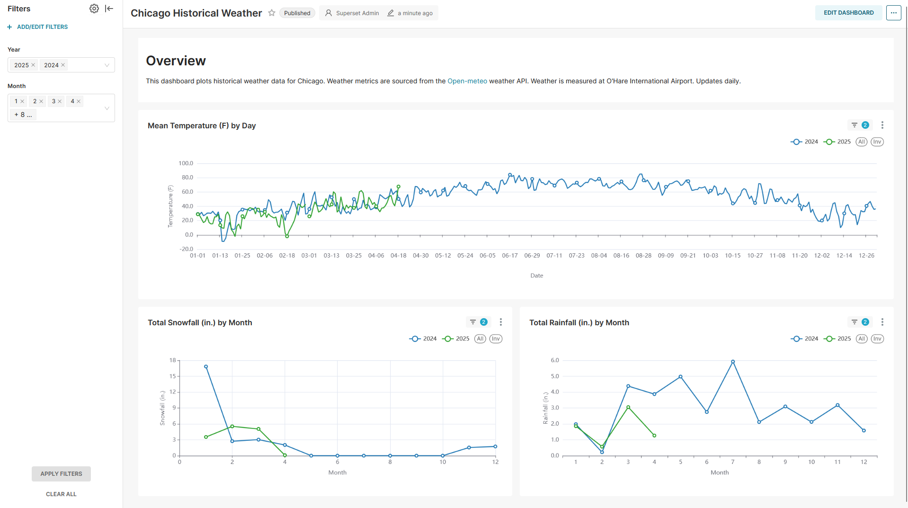

# Chicago Weather Dashboard

Link to dashboard: <https://chi-weather-historical-dash.onrender.com/superset/dashboard/p/wJBVlwklyo2/> 
(it may take a few minutes to load because Render fully spins down the website when inactive)

This small data engineering project plots three key weather metrics in Chicago that are of interest for historical comparison:
daily temperature, snowfall, and precipitation. It is inspired by many kitchen conversations/debates
I've had as to whether this year has been colder, snowier, etc. than previous years. Since my memory
hasn't always been accurate, I decided to create a small dashboard to rely on data instead. See below
for a screenshot: 

 

Weather readings are for O'Hare International Airport. Data is available starting January 1, 2000 and 
updates daily with the latest temperature readings at midnight CT.

## Architecture

Currently, the pipeline consists of:

1. A Python script that fetches daily weather data using the [Open-meteo](https://open-meteo.com/)
API, which runs daily at midnight as a [Github action](https://github.com/features/actions);

2. [Supabase](https://supabase.com/) as a warehouse to store the fetched data in a PostgreSQL
database;

3. Apache [Superset](https://superset.apache.org/) to create and display the dashboard;

3. A free [Render](https://render.com/) website that hosts the Superset instance and the dashboard.